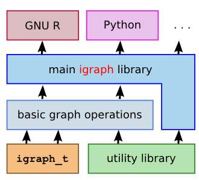
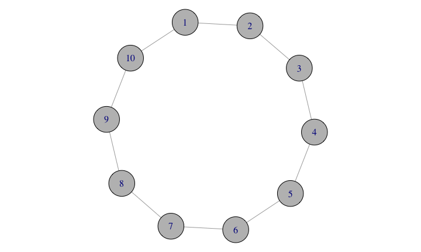
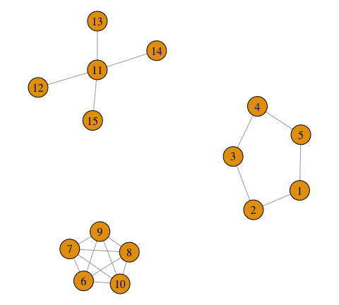

# What's new in igraph and networks
Gábor Csárdi  
`r Sys.Date()`  


## About igraph



## About igraph

* Network analysis library, written mostly in C/C++.
* Interface to R and Python
* https://github.com/igraph
* http://igraph.org
* Mailing list, stack overflow help.
* Open GitHub issues for bugs

## What is new?

* New ways to manipulate networks
* `[` and `[[` operators
* Better function names, manipulators
* Pipe friendly
* New methods:
    * Graph layout algorithms
    * New methods for graph clustering
    * Graphlet decomposition
    * Embeddings
    * Graph matching
    * etc.

## The `[` operator

Imaginary adjacency matrix, queries


```r
air['BOS', 'SFO']
```

```
#> [1] 6
```

```r
CA <- c("LAX", "SFO", "SAN", "SMF", "SNA", "BUR", "OAK", "ONT", "SJC")
air['BOS', CA]
```

```
#> LAX SFO SAN SMF SNA BUR OAK ONT SJC 
#>   7   6   1   0   0   0   0   0   1
```

## The `[` operator

Imaginary adjacency matrix, manipulation

Add an edge (and potentially set its weight):

```r
air["BOS", "ANC"] <- TRUE
air["BOS", "ANC"]
```

```
#> [1] 1
```

Remove an edge:

```r
air["BOS", "ANC"] <- FALSE
air["BOS", "ANC"]
```

```
#> [1] 0
```

## The `[[` operator

Imaginary adjacency list, adjacenct vertices:


```r
air[["BOS"]]
```

```
#> $BOS
#> + 269/755 vertices, named:
#>   [1] BGR JFK JFK JFK JFK JFK JFK JFK JFK JFK JFK JFK JFK JFK JFK
#>  [16] LAS LAS LAS MIA MIA EWR EWR EWR EWR EWR EWR EWR EWR EWR EWR
#>  [31] LAX LAX LAX LAX LAX LAX LAX PBI PBI PIT PIT PIT PIT PIT SFO
#>  [46] SFO SFO SFO SFO SFO IAD IAD IAD IAD IAD IAD IAD IAD IAD IAD
#>  [61] BDL BDL BUF BUF BUF BUF BWI BWI BWI BWI BWI BWI BWI BWI CAK
#>  [76] CLE CLE CLE CLE CLE CLT CLT CLT CLT CLT CLT CLT CLT CLT CMH
#>  [91] CMH CVG CVG CVG CVG CVG CVG CVG CVG CVG CVG DCA DCA DCA DCA
#> [106] DCA DCA DCA DCA DCA DTW DTW DTW DTW DTW DTW DTW DTW DTW DTW
#> [121] DTW DTW DTW GSO IND IND LGA LGA LGA LGA LGA LGA LGA LGA MDT
#> [136] MKE MKE MKE MSP MSP MSP MSP MSP MSP MSY MYR ORF PHF PHL PHL
#> + ... omitted several vertices
```

## The `[[` operator

Imaginary adjacency list, adjacent vertices:


```r
air[[, "BOS"]]
```

```
#> $BOS
#> + 256/755 vertices, named:
#>   [1] BGR JFK JFK JFK JFK JFK JFK JFK JFK JFK JFK JFK JFK LAS LAS
#>  [16] LAS MIA MIA MIA EWR EWR EWR EWR EWR EWR EWR EWR LAX LAX LAX
#>  [31] LAX LAX LAX LAX LAX PBI PBI PIT PIT PIT PIT SFO SFO SFO SFO
#>  [46] SFO SFO IAD IAD IAD IAD IAD IAD IAD IAD IAD BDL BDL BDL BUF
#>  [61] BUF BUF BUF BWI BWI BWI BWI BWI BWI CAK CAK CLE CLE CLE CLE
#>  [76] CLE CLE CLT CLT CLT CLT CLT CLT CLT CLT CMH CMH CVG CVG CVG
#>  [91] CVG CVG CVG DCA DCA DCA DCA DCA DCA DCA DCA DCA DTW DTW DTW
#> [106] DTW DTW DTW DTW DTW DTW DTW DTW DTW IND IND LGA LGA LGA LGA
#> [121] LGA LGA MDT MKE MKE MKE MSP MSP MSP MSP MSP MSP MSP MSP MSY
#> [136] MSY MYR PHF PHL PHL PHL PHL PHL PHL PHL PHL PHL RDU RDU RDU
#> + ... omitted several vertices
```

## Consistent function names

`make_*`, `sample_*`, `cluster_*`, `layout_*`, `graph_from_*`,
`as_*`, etc.

## Manipulators for `make_` and `sample_`


```r
ring <- make_(ring(10), with_vertex_(color = "grey", size = 25))
par(mar=c(0,0,0,0)); plot(ring)
```

 

## Manipulators for `make_` and `sample_`


```r
rg <- sample_(degseq(c(2,4,6,8,2,2,2,2)),
              simplified())
```

## Manipulators for `layout_`


```r
g <- make_ring(5) + make_full_graph(5) + make_star(5, mode="undir")
coords <- layout_(g, in_circle(), component_wise())
par(mar=c(0,0,0,0)); plot(g)
```

 

## Pipe friendly syntax


```r
g <- make_empty_graph(10) %>%
  add_vertices(5) %>%
  set_vertex_attr("name", value = LETTERS[1:5]) %>%
  add_edges(c(1,2,2,3,3,4,4,5,5,1)) %>%
  set_edge_attr("weight", value = runif(gsize(.)))
```

## Easier connection to other packages


```r
library(networkD3)
d3_net <- simpleNetwork(as_data_frame(karate, what = "edges")[, 1:3])
d3_net
```

<!--html_preserve--><div id="htmlwidget-6244" style="width:720px;height:432px;" class="simpleNetwork"></div>
<script type="application/json" data-for="htmlwidget-6244">{"x":{"links":{"source":["Mr Hi","Mr Hi","Mr Hi","Mr Hi","Mr Hi","Mr Hi","Mr Hi","Mr Hi","Mr Hi","Mr Hi","Mr Hi","Mr Hi","Mr Hi","Mr Hi","Mr Hi","Mr Hi","Actor 2","Actor 2","Actor 2","Actor 2","Actor 2","Actor 2","Actor 2","Actor 2","Actor 3","Actor 3","Actor 3","Actor 3","Actor 3","Actor 3","Actor 3","Actor 3","Actor 4","Actor 4","Actor 4","Actor 5","Actor 5","Actor 6","Actor 6","Actor 6","Actor 7","Actor 9","Actor 9","Actor 9","Actor 10","Actor 14","Actor 15","Actor 15","Actor 16","Actor 16","Actor 19","Actor 19","Actor 20","Actor 21","Actor 21","Actor 23","Actor 23","Actor 24","Actor 24","Actor 24","Actor 24","Actor 24","Actor 25","Actor 25","Actor 25","Actor 26","Actor 27","Actor 27","Actor 28","Actor 29","Actor 29","Actor 30","Actor 30","Actor 31","Actor 31","Actor 32","Actor 32","Actor 33"],"target":["Actor 2","Actor 3","Actor 4","Actor 5","Actor 6","Actor 7","Actor 8","Actor 9","Actor 11","Actor 12","Actor 13","Actor 14","Actor 18","Actor 20","Actor 22","Actor 32","Actor 3","Actor 4","Actor 8","Actor 14","Actor 18","Actor 20","Actor 22","Actor 31","Actor 4","Actor 8","Actor 9","Actor 10","Actor 14","Actor 28","Actor 29","Actor 33","Actor 8","Actor 13","Actor 14","Actor 7","Actor 11","Actor 7","Actor 11","Actor 17","Actor 17","Actor 31","Actor 33","John A","John A","John A","Actor 33","John A","Actor 33","John A","Actor 33","John A","John A","Actor 33","John A","Actor 33","John A","Actor 26","Actor 28","Actor 30","Actor 33","John A","Actor 26","Actor 28","Actor 32","Actor 32","Actor 30","John A","John A","Actor 32","John A","Actor 33","John A","Actor 33","John A","Actor 33","John A","John A"]},"options":{"linkDistance":50,"charge":-200,"fontSize":7,"linkColour":"#666","nodeColour":"#3182bd","nodeClickColour":"#E34A33","textColour":"#3182bd","opacity":0.6,"zoom":false}},"evals":[]}</script><!--/html_preserve-->

## Current work

* Better connection to other packages and external software 
* Inference
* Infrastructure cleanup
